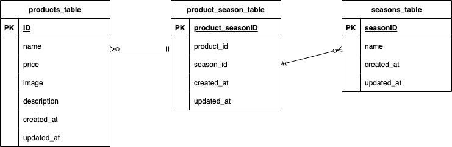

# mogitate(果物検索サイト)

## 環境構築
**Dockerビルド**
1. アプリケーションをクローンするディレクトリに移動
2. `git clone git@github.com:Koharu5810/confirmation-test2.git`
3. `cd confirmation-test2`
4. DockerDesktopアプリを立ち上げる または `open -a docker`
5. `docker-compose up -d --build`

> MacのM1・M2チップのPCの場合
> no matching manifest for linux/arm64/v8 in the manifest list entriesのメッセージが表示されビルドができないことがあります。
> エラーが発生する場合は、docker-compose.ymlファイルの「mysql」内に「platform」の項目を追加で記載してください
> その後`docker-compose down`でコンテナを停止し、`docker-compose up -d --build`で再ビルドしてください。
```bash
services:
  mysql:
    platform: linux/amd64

  phpmyadmin:
    platform: linux/amd64
```

**Laravel環境構築**
1. `docker-compose exec php bash`
2. `composer install`
3. 「.env.example」ファイルを 「.env」ファイルに命名を変更。または、新しく.envファイルを作成
4. .envに以下の環境変数を追加
``` text
DB_CONNECTION=mysql
DB_HOST=mysql
DB_PORT=3306
DB_DATABASE=laravel_db
DB_USERNAME=laravel_user
DB_PASSWORD=laravel_pass
```
5. アプリケーションキーの作成
``` bash
php artisan key:generate
```

6. マイグレーションの実行
``` bash
php artisan migrate
```

7. シーディングの実行
``` bash
php artisan db:seed
```

## 使用技術(実行環境)
| 言語・フレームワーク    | バージョン   |
| :------------------- | :--------- |
| PHP                  | 7.4.9      |
| Laravel              | 8.83.27    |
| MySQL                | 9.0.1      |

## ER図


## URL
- 開発環境：http://localhost/products
- phpMyAdmin:：http://localhost:8080/